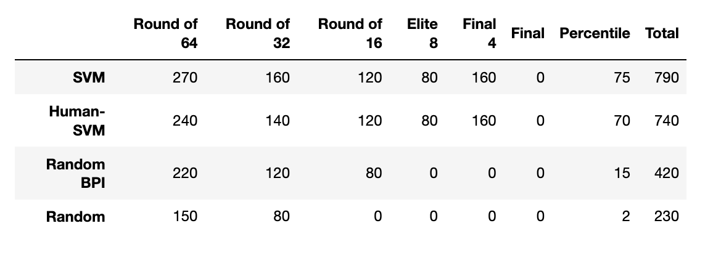
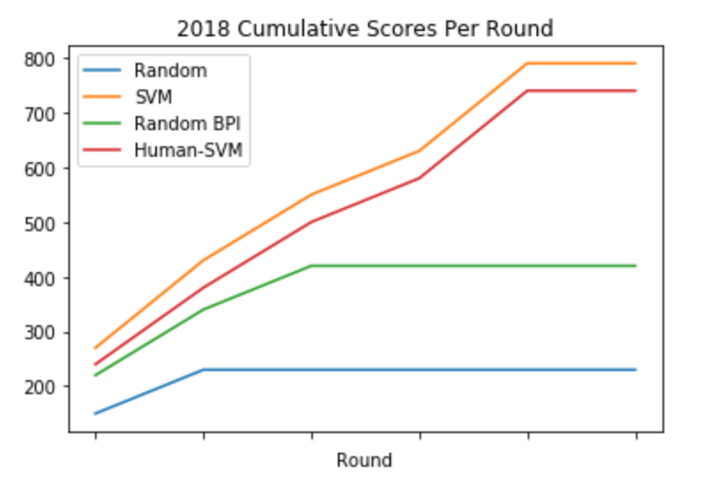

# Results

## 2018 Tournament
- Successfully predicted 27/32 games in the First Round of the 2018 Tournament.
- It scored in the 75th percentile of ESPN Bracket Challenge users
- SVM classifier trained on ppg, oe, de, fge, or, rpi

I chose an SVM because they generally perform well with binary classification in a multi-dimensional space.
During the development of this project, it consistently performed better than Decision Trees, Naive Bayes Classifiers, and Random Forests.
The optimal hyperparameters were determined using 10-fold cross-validation techniques.
The algorithm itself comes from Sci-Kit Learn.

The raw data shows that the SVM fared much better than purely random choices as well as Random BPI, which makes random choices weighted with ESPN's BPI metric. The SVM likely would have fared better than the bracket I would have created because the "corrections" I made to the model for the "Human-SVM" model decreased it's score slightly.

This graph shows how the each bracket accumulated points as the rounds progressed. The SVM had a steady upwards trajectory, indicating that it was making good choices in early rounds since fewer errors were propagating to later ones. This indicates it might have fared better if a one seed had not lost to a sixteen seed for the first time in history (UVa vs Virginia) in the first round.