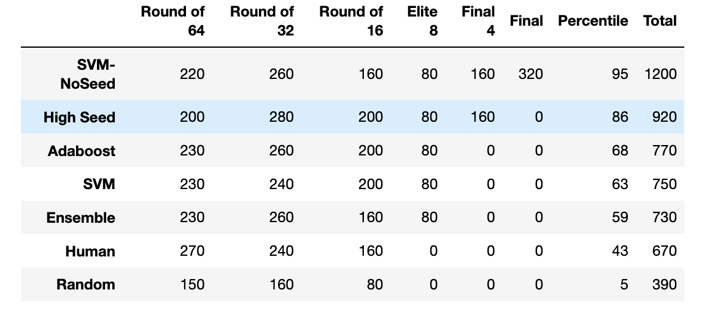
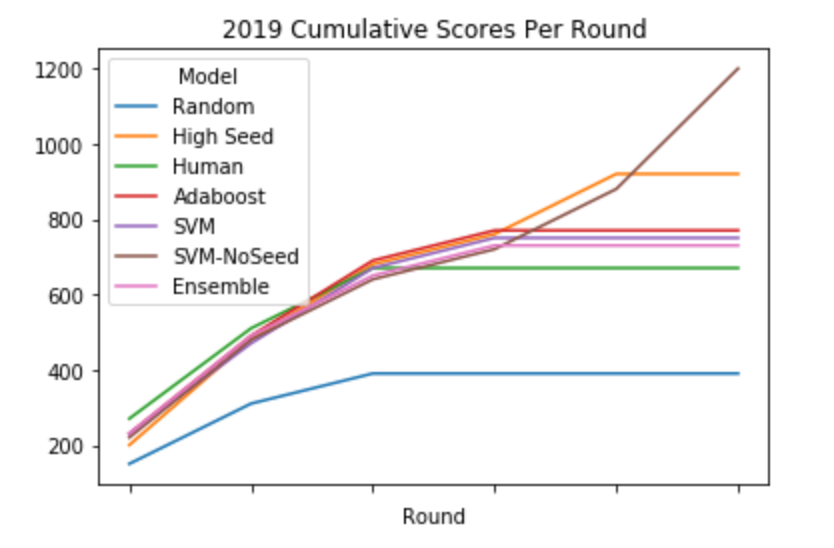

# Methodology (2019)
The models are trained on the following statistics:
- Average Points per Game (ppg)
- Offensive Efficiency (oe)
- Defensive Efficiency (de)
- Field Goal Efficiency (fge)
- Offensive Rebounds (or)
- RPI
- Win Percentage (winp)
- Effective Possession Ratio (epr)
- Seed

These features were chosen because they represent a diverse range of metrics about teams including both offense and defense. When plotting each game's data (more on how this is calculated below) as a density function and grouping based on which team wins, these metrics show a degree of separability in the means, indicating they can help distinguish between wins and upsets (see Jupyter notebook for more detail).


Since the classifier is meant to predict the outcome of a game, each game needs a numerical representation.
If we arbitrarily assign one team to be Team One and the other to be Team Two, then a way to represent the game is the difference between corresponding statistics for each team.

```
high_seed = 1 if team_one_seed > team_two_weed
features = [team_one_stats - team_two_stats, high_seed]
```

Since seeding can encode general information about how strong a team is, it is a good metric to include in classification. Reducing the seed to a `1` or a `2` instead of taking the difference of the seeds limits how much the classifier accounts for seed since there is no difference between a `1 vs 16` matchup and a `8 vs 9`.

Thus, the classifier can be given two teams which are matching up and output either 1 or 2 depending on which team it believes will win.
By entering each matchup and progressing up the bracket, we can construct a bracket for the Tournament.

Because there is limited data about previous years because the dataset had to be constructed by hand, I needed to process the data to expand the dataset as well as fix class imbalance. I explored various methods of doing this in `Analysis.ipynb` and evaluated their efficacy by seeing how models trained on them performed (in terms of accuracy and how much accuracy varied). The method which worked best was simply to invert each game's data to effectively double the size of the training set.

```
features_new = -1 * features_old
label_new = 2 if label_old = 1 else 1
```
# Results (2019 Tournament)
- Used an ensemble of classifiers
    - Adaboost Classifier and Support Vector Machine trained on ppg, oe, de, fge, or, rpi, epr, winp, seed
    - Support Vector Machine trained on ppg, oe, de, fge, or, rpi, epr, winp

Both Adaboost and the SVM performed the best on the dataset. They had the highest average accuracy in 10-fold cross-validation with the lowest variance in accuracy. Logically, this makes sense because an SVM is merely finding the best separation plane of the data, and Adaboost is finding the best separation boundaries for each features.

The model I predicted would fare the best was the ensemble of classifiers which I mentioned above. I also kept track of how each individual classifier fared.



All models fared significantly better than if they had made random choices. They also fared better than a human with minimal knowledge about college basketball (me). However, for the most part, they did not do better than the bracket which merely picked the Highest Seed to win. Only the SVM which did not take into account seed fared better than the High Seed bracket. This might indicate that taking into account seed does not allow the model to generalize well because statistically, seeding is a strong indicator of who will win a game. Another interesting point is that the ensemble method did the worst of all the models. It is unclear why this was the case.


The graph of cumulative scores demonstrates that almost brackets fared mostly the same in the early rounds, but towards, the end, the SVM which did not take seed into account won because fewer error's propagated throughout the rounds.

