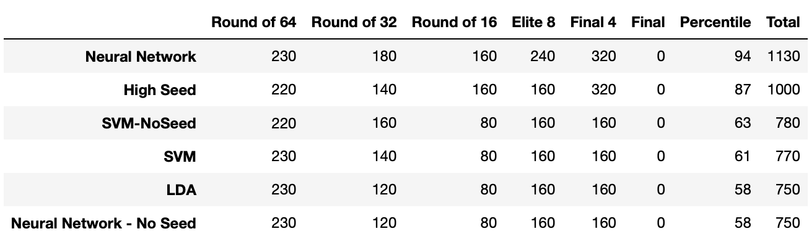
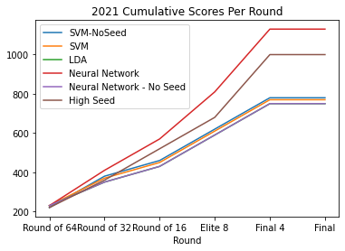

# Methodology
Since the Kaggle dataset has only raw game data without any team statistics, these statistics need to be computed from the game data.
The following metrics were computed from the regular season statistics to be used as features for classification.
- Offensive Efficiency (oe)
- Defensive Efficiency (de)
- Field Goal Efficiency (fge)
- Offensive Rebounds (or)
- Effective Possession Ratio (epr)
- Win Percentage (wp)
The seed of each team was also used as a feature to the algorithm.

The actual features that were fed into the algorithms as training data were the difference of the statistics between the two teams.
Each algorithm would predict if the first team or the second team would win the match.

## Metrics
**Offensive Efficiency**
```
points_scored / (field_goal_attempts - offensive_rebounds + turnovers + 0.45 * free_throw_attempts)
```
**Defensive Efficiency**
```
opp_points_scored / (field_goal_attempts - offensive_rebounds + turnovers + 0.45 * free_throw_attempts)
```
**Field Goal Efficiency**
```
(2pt_fg_made + 1.5 * 3pt_ft_made) / fg_attempts
```
**Offensive Rebound**
```
offensive_rebounds / (offensive_rebounds + opp_defensive_rebounds)
```
**Effective Posession Ratio**
```
possessions = field_goal_attempts - offensive_rebounds + turnovers + 0.45 * free_throw_attempts
(possessions + offensive_rebounds - turnovers) / possessions
```
**Win Percentage**
```
(wins + 0.5 * ties) / total_games
```
# Results


As with previous iterations of this project, simply choosing the highest seed winner would produce a fairly good bracket.
Here, the Neural Network which took into account seed did best, which is interesting because in 2019, the SVM which didn't take seed into account did the best.
This means the previous explanation that incorporating seed skewed results since seed was very correlated with winning is not as clear cut.


The graph of cumulative scores demonstrates that almost brackets fared mostly the same in the early rounds, but towards, the end, the Neural Network won because fewer error's propagated throughout the rounds.
This is identical to the reason why the the SVM in 2019 fared better. This suggests a good strategy for building good brackets is to optimize for "robustness" instead of trying to predict every game correctly.