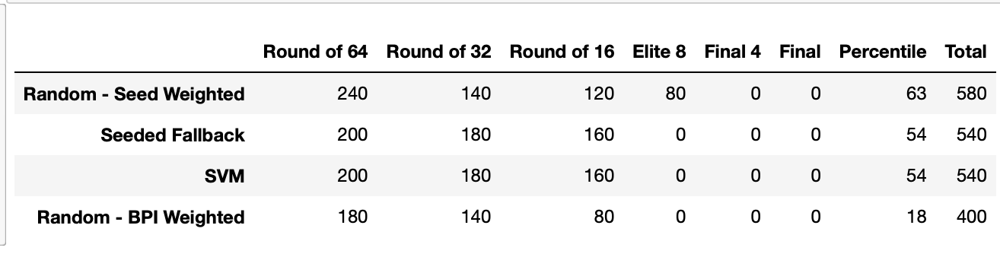
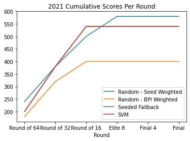

# Methodology
Since the Kaggle dataset has only raw game data without any team statistics, these statistics need to be computed from the game data.
The following metrics were computed from the regular season statistics to be used as features for classification.
- Offensive Efficiency (oe)
- Defensive Efficiency (de)
- Field Goal Efficiency (fge)
- Offensive Rebounds (or)
- Effective Possession Ratio (epr)
- Win Percentage (wp)
The seed of each team was also used as a feature to the algorithm.

The actual features that were fed into the algorithms as training data were the difference of the statistics between the two teams.
Each algorithm would predict if the first team or the second team would win the match.

## Metrics
**Offensive Efficiency**
```
points_scored / (field_goal_attempts - offensive_rebounds + turnovers + 0.45 * free_throw_attempts)
```
**Defensive Efficiency**
```
opp_points_scored / (field_goal_attempts - offensive_rebounds + turnovers + 0.45 * free_throw_attempts)
```
**Field Goal Efficiency**
```
(2pt_fg_made + 1.5 * 3pt_ft_made) / fg_attempts
```
**Offensive Rebound**
```
offensive_rebounds / (offensive_rebounds + opp_defensive_rebounds)
```
**Effective Posession Ratio**
```
possessions = field_goal_attempts - offensive_rebounds + turnovers + 0.45 * free_throw_attempts
(possessions + offensive_rebounds - turnovers) / possessions
```
**Win Percentage**
```
(wins + 0.5 * ties) / total_games
```
## Classifiers
For 2022, I used trained 2 different SVM classifiers. One of them included all
features + the difference in seeds of each team. The second included all
features except for the seed information.

# Results


The SVM classifier exhibited instability for matches close to the decision
boundary, meaning that for some matches, swapping the ordering of the teams
made a difference in the prediction. To get around this, the "Seeded Fallback"
bracket uses the SVM trained with seed information, and if switching the order
of the teams changes the prediction of the model, then the SVM trained without
seed is used.

This time, all brackets did very poorly due to a number of upsets that occurred
throughout the tournament. Picking randomly, but weighted by seed, performed
the best while picking randomly based on ESPNs BPI metric fared the worst. Each
model correctly predicted 20 of the first 32 games, which is not great, but
still better than random.



The graph of cumulative scores again demonstrates that almost brackets fared
mostly the same in the early rounds, but towards, the end, the Random Seed
Weighted strategy minimized propogation errors, which is why the Neural Network
in 2021 and SVM in 2019 fared well.
