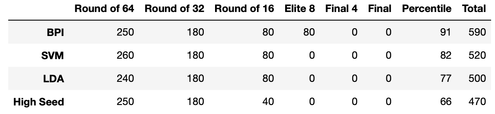
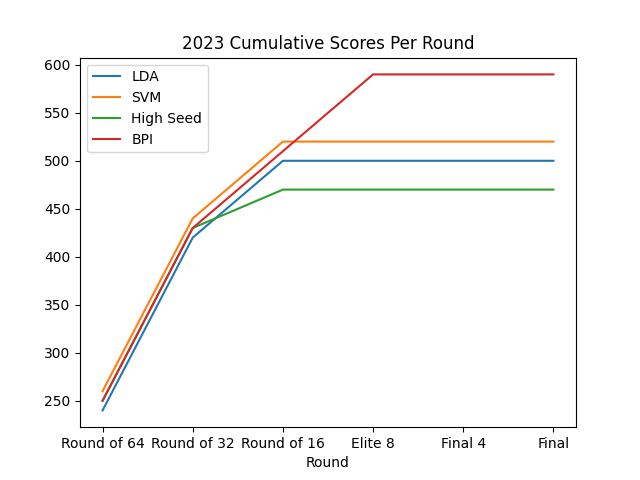

# Methodology
The methodology has remained largely the same as in previous years. Using the
Kaggle dataset, I compute important statistics for each team using their
regular season data.

- Offensive Efficiency (oe)
- Defensive Efficiency (de)
- Field Goal Efficiency (fge)
- Offensive Rebounds (or)
- Effective Possession Ratio (epr)
- Win Percentage (wp)
The seed of each team was also used as a feature to the algorithm.

The actual features that were fed into the algorithms as training data were the difference of the statistics between the two teams.
Each algorithm would predict if the first team or the second team would win the match.

## Metrics
See [the 2022 metrics section](../2022/README.md)

## Classifiers
I trained an SVM and LDA classifier on all of the features, including seed.

The baseline model to compare against was a High Seed model which always picks
the higher seed to win and does a coin flip if both seeds are equal. I also
benchmarked against a random bracket where each decision is weighted by ESPNs
BPI metric.

## Single Perturbation Robustness
In a new development from previous years, I tried to predict which bracket would be the best based
on an evaluation metric, which I call the "Single Perturbation Robustness". The metric is defined as follows:

For each game in the bracket
1. Suppose the bracket is wrong, and generate the resulting bracket using the prediction function. 
2. Compute the score of the new bracket and compute the error incurred assuming the original bracket is 100% correct
3. Weight the error by the probability of it occurring based on a probability model
4. Sum together all the weighted single perturbation errors

This metric was inspired by the observation that historically, the brackets
that performed the best minimized propagation errors from one round to the next.

For the probability model, I used past tournament data and to compute the
likelihood of seed X beating seed Y in round Z. The SVM model was the most
robust under this metric out of the LDA and High Seed brackets.

# Results

