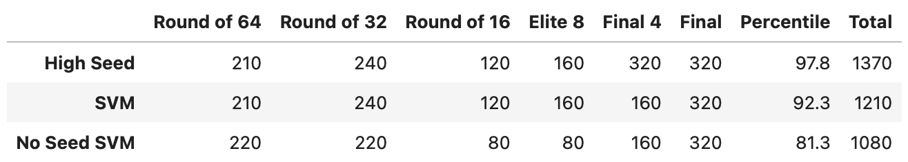
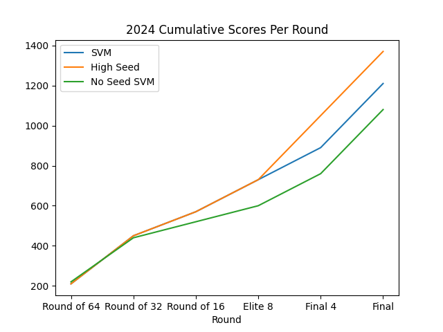

# Methodology
The methodology has remained largely the same as in previous years. Using the
Kaggle dataset, I compute important statistics for each team using their
regular season data.

- Offensive Efficiency (oe)
- Defensive Efficiency (de)
- Field Goal Efficiency (fge)
- Offensive Rebounds (or)
- Effective Possession Ratio (epr)
- Win Percentage (wp)
The seed of each team was also used as a feature to the algorithm.

The actual features that were fed into the algorithms as training data were the difference of the statistics between the two teams.
Each algorithm would predict if the first team or the second team would win the match.

## Metrics
In 2024, I tried to use a new mixture of metrics
- Mean Score,
- Defensive Rebounds
- PF
- Blocks
- FGA
- Opponents Defensive Rebounds
- Margin,
- Offensive Efficiency

Because previous tournaments showed the model mostly throwing out all the data
except the seed, I did not include seed.

## Classifiers
I trained an SVM on all of the features mentioned above. I also trained an SVM on the features used [previously](../2022/README/md)

The baseline model to compare against was a High Seed model which always picks
the higher seed to win and does a coin flip if both seeds are equal.

The features from pre-2024 did much better, but that's possibly because simply
picking the highest seed did the best.

# Results

