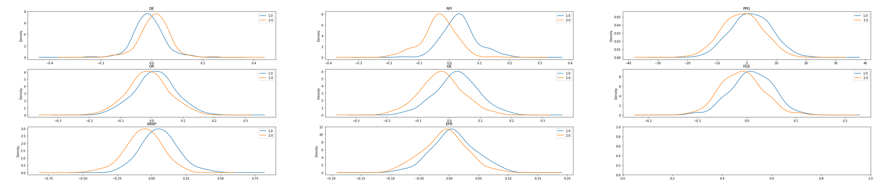

# March Madness Bracket Maker

# Background
The NCAA March Madness tournament is notorious for having game outcomes which are almost impossible to predict because underdog teams beat the favorites.
However, there are statistics about each team in the tournament which can be used to predict the winner of a game and thus create a bracket.

# Data Files
All data is contained in the `MasterData.xlsx` spreadsheet.

The `GameData` sheet contains the matchups from the 2016, 2017, and 2018 tournaments.

The sheets named with a specific season (i.e 2018-2019) contain the statistics for each team in the NCAA for that season

All data was taken from https://www.teamrankings.com/ncb/team-stats/

# Python Files
- `data_extract.py` contains helper methods for extracting data, training the classifier, and saving it to disk.
- `builder.py` contains a class called BracketBuilder which encapsulates the functionality of building a bracket.
- `execute.py` creates a BracketBuilder object with the specified classifers (which were trained in `Analysis.ipynb`) and begins prompting the user to build a bracket.

# Methodology
The models are trained on the following statistics:
- Average Points per Game (ppg)
- Offensive Efficiency (oe)
- Defensive Efficiency (de)
- Field Goal Efficiency (fge)
- Offensive Rebounds (or)
- RPI
- Win Percentage (winp)
- Effective Possession Ratio (epr)
- Seed

These features were chosen because they represent a diverse range of metrics about teams including both offense and defense. When plotting each game's data (more on how this is calculated below) as a density function and grouping based on which team wins, these metrics show a degree of separability in the means, indicating they can help distinguish between wins and upsets (see Jupyter notebook for more detail).



Since the classifier is meant to predict the outcome of a game, each game needs a numerical representation.
If we arbitrarily assign one team to be Team One and the other to be Team Two, then a way to represent the game is the difference between corresponding statistics for each team.

```
high_seed = 1 if team_one_seed > team_two_weed
features = [team_one_stats - team_two_stats, high_seed]
```

Since seeding can encode general information about how strong a team is, it is a good metric to include in classification. Reducing the seed to a `1` or a `2` instead of taking the difference of the seeds limits how much the classifier accounts for seed since there is no difference between a `1 vs 16` matchup and a `8 vs 9`.

Thus, the classifier can be given two teams which are matching up and output either 1 or 2 depending on which team it believes will win.
By entering each matchup and progressing up the bracket, we can construct a bracket for the Tournament.

Because there is limited data about previous years because the dataset had to be constructed by hand, I needed to process the data to expand the dataset as well as fix class imbalance. I explored various methods of doing this in `Analysis.ipynb` and evaluated their efficacy by seeing how models trained on them performed (in terms of accuracy and how much accuracy varied). The method which worked best was simply to invert each game's data to effectively double the size of the training set.

```
features_new = -1 * features_old
label_new = 2 if label_old = 1 else 1
```

# Results
## 2018 Tournament
- Successfully predicted 27/32 games in the First Round of the 2018 Tournament.
 - It scored in the 75th percentile of ESPN Bracket Challenge users
 - SVM classifier trained on ppg, oe, de, fge, or, rpi

Support Vector Machines generally perform well with binary classification in a multi-dimensional space.
During the development of this project, it consistently performed better than Decision Trees, Naive Bayes Classifiers, and Random Forests.
The optimal hyperparameters were determined using 10-fold cross-validation techniques.
The algorithm itself comes from Sci-Kit learn

## 2019 Tournament
- Used an ensemble of classifiers
    - Adaboost Classifier and Support Vector Machine trained on ppg, oe, de, fge, or, rpi, epr, winp, seed
    - Support Vector Machine trained on ppg, oe, de, fge, or, rpi, epr, winp
    - Results TBD

Both Adaboost and the SVM performed the best on the dataset. They had the highest average accuracy in 10-fold cross-validation with the lowest variance in accuracy. Logically, this makes sense because an SVM is merely finding the best separation plane of the data, and adaboost is finding the best separation boundaries for each features.


